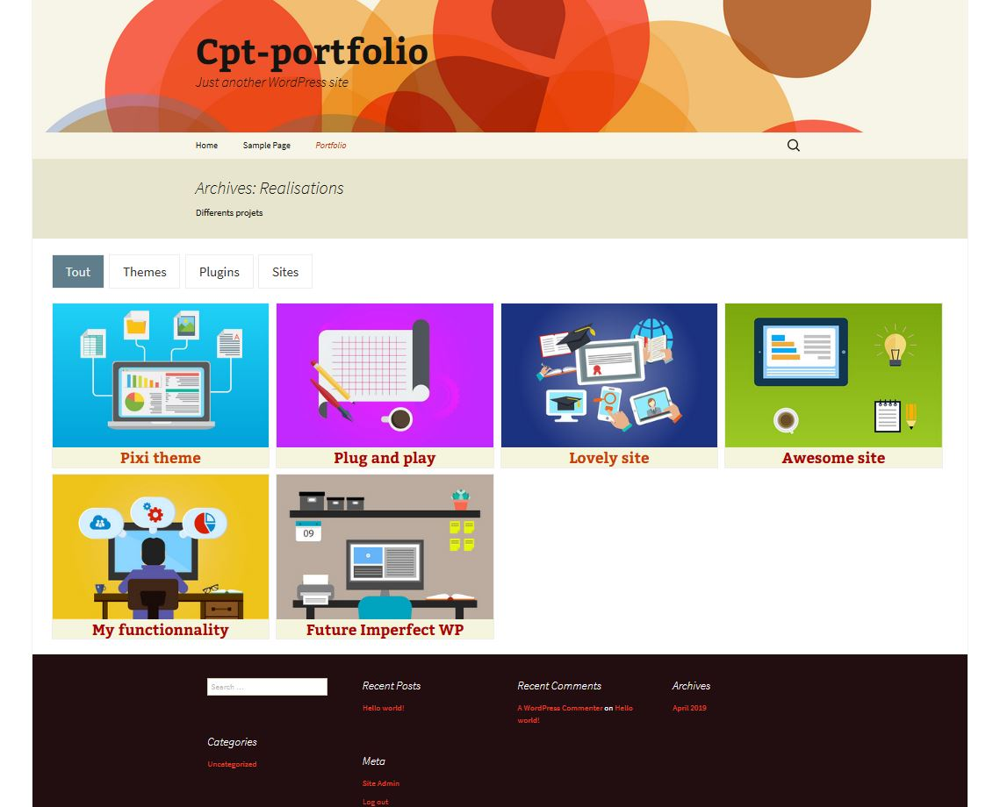

# Portfolio with Filtering added in a theme

This is an exemple of how I have integrated a Portfolio in [Pixiscreen Theme](https://pixiscreen.fr/realisations/).

Here, to test it, functionnalities are added in a Twentythirteeen child theme to make it easy to show how it works.

It is Compatible with WordPress version > 5.

## Custom Post Type

To create a Portfolio, first, I add a custom Post Type "Realisation" in the theme (here a child Theme). See /inc/cpt-realisation.php

## Custom Taxonomy

To rank the "Realisations", I use a custom Taxonomy "Type". See /inc/cpt-realisation.php

## Sort the Realisations

To sort the display of the "Realisations" on the archive page, I used [isotope.metafizzy.co](https://isotope.metafizzy.co)

## How to test it ?

1. Add Twentythirteen theme using Dashboard.
2. Add this Twentythirteen-child theme in your folder : wp-content/themes/ : `git clone https://github.com/valerieblanchard/test-portfolio-filtering.git`
3. In your dasboard, activate this child theme.
4. Using Dashboard, add some medias. You can use the e.g. images included in this child theme in img folder.
5. Regenerate Permalinks to take the custom post type into account.

### Create some "Types" (taxonomy for CPT "realisation")

To rank the "Realisations", use the custom Taxonomy "Type", create as many as you need. For exemple: Themes, Plugins, Sites.

### Create some new "Realisations"

Add your title and content for your "realisation"

Choose a Type created before or add a new one.

Don't forget to choose a featured image, it is used in your Portfolio Archive page.

Publish your "realisation"

### Create a menu

Go to Appearance => Menus

Open "Realisations" and click "view all" : choose "All Realisations", this is the Post Type Archive. You can change its name to whatever you want, for e.g. "Portfolio".

Go to the front, it should works !!!